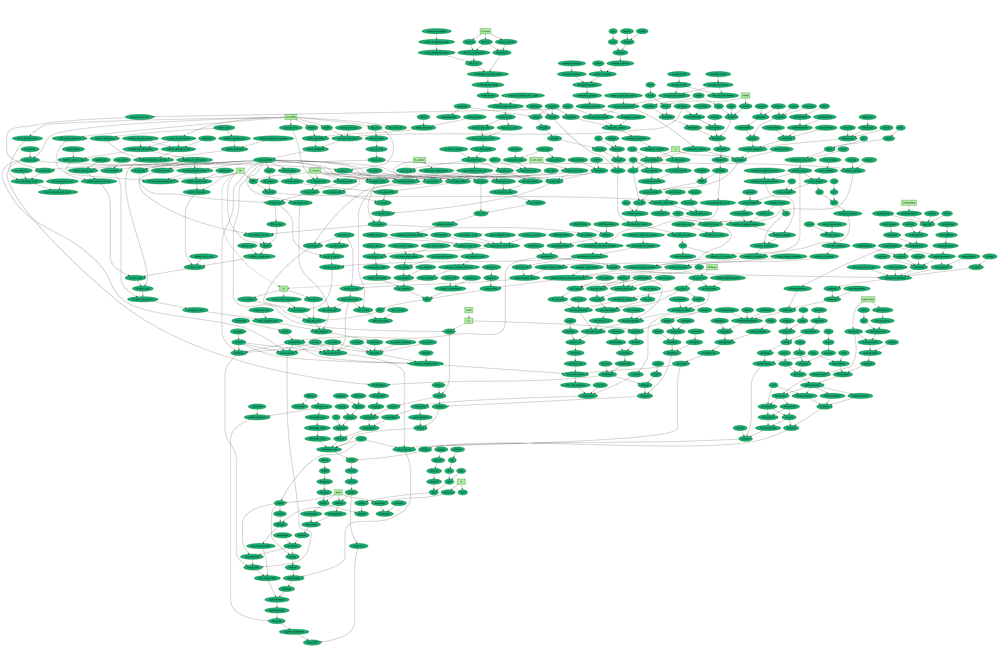

# Strong PNT Fork

This repo was forked from <https://github.com/math-inc/strongpnt>.  My aim is to attempt to tidy their AI generated code and keep it current with Mathlib and the PrimeNumberTheoremAnd project.  Changes from the original so far:
* bump to Mathlib 4.22.0 and the latest version of PrimeNumberTheoremAnd.
* Make the StrongPNT proof depend on results in MediumPNT.lean rather than lots of duplication.

Original Readme.md follows:


# *The strong Prime Number Theorem*

[](https://math-inc.github.io/strongpnt/blueprint) [](https://math-inc.github.io/strongpnt/blueprint.pdf) [](https://math-inc.github.io/strongpnt/blueprint/dep_graph_document.html) [](https://math-inc.github.io/strongpnt/docs/) [](https://www.math.inc/)

This repository contains an AI-generated Lean formalization of the strong Prime Number Theorem (PNT) and the complex-analysis infrastructure used in its proof.

Most of the statements and proofs were produced by Gauss, an autoformalization agent. The development was completed with targeted human scaffolding and review of key lemmas and strategies. The finished Lean development is substantial (over 25k lines and 1.1k theorems/definitions) and shows how AI agents can accelerate large formalization efforts when combined with human guidance. See [Gauss](https://www.math.inc/gauss) and [Math Inc.](https://www.math.inc/) for more background.

## Highlights

- Target: the strong Prime Number Theorem.
- Generated by the Gauss autoformalization agent, with human supervision.
- Scale: ≈25k lines of Lean and ≈1.1k theorems/definitions.
- Time to completion: three weeks.



## Links

- [Blueprint](https://math-inc.github.io/strongpnt/blueprint)
- [Blueprint (PDF)](https://math-inc.github.io/strongpnt/blueprint.pdf)
- [Dependency graph](https://math-inc.github.io/strongpnt/blueprint/dep_graph_document.html)
- [Documentation](https://math-inc.github.io/strongpnt/docs/)
- [Math Inc.](https://www.math.inc/)
- [Gauss (autoformalization agent)](https://www.math.inc/gauss)

## Details

**Dependency:** this development reuses definitions and some proofs from the [PrimeNumberTheoremAnd](https://github.com/AlexKontorovich/PrimeNumberTheoremAnd) project (Medium PNT). In particular, `PNT5_StrongPNT.lean`, `Z0.lean`, and `ZetaZeroFree.lean` were adapted from that work.

**Generated content:** `PNT1_ComplexAnalysis.lean`, `PNT2_LogDerivative.lean`, `PNT3_RiemannZeta.lean`, and `PNT4_ZeroFreeRegion.lean` were produced by the Gauss autoformalization agent with human supervision. Lean statements and proofs were generated by the Gauss agent. Humans provided the high-level blueprint, reviewed critical lemmas, and adapted prior work where needed.

**Repository layout:**

- [`StrongPNT/`](StrongPNT/) - principal Lean source files produced or adapted for this project.
- [`blueprint/`](blueprint/) - LaTeX blueprint and content used by the autoformalizer.

## Useful commands

Compile the Lean files (requires [`Lean`](https://docs.lean-lang.org/lean4/doc/quickstart.html)):

```sh
lake build
```

Build the blueprint PDF (requires [`uv`](https://docs.astral.sh/uv/)):

```sh
uvx leanblueprint pdf
```

Build and serve the blueprint website:

```sh
uvx leanblueprint web && uvx leanblueprint serve
```
